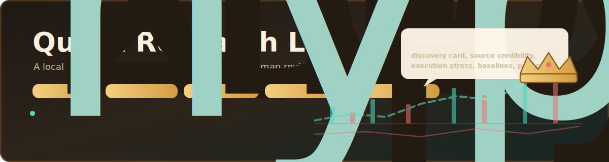
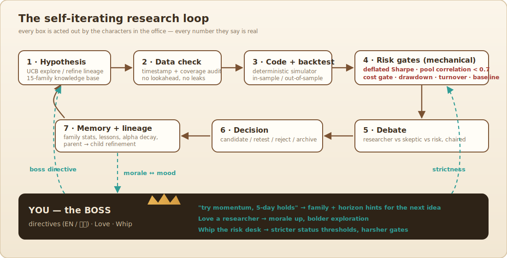
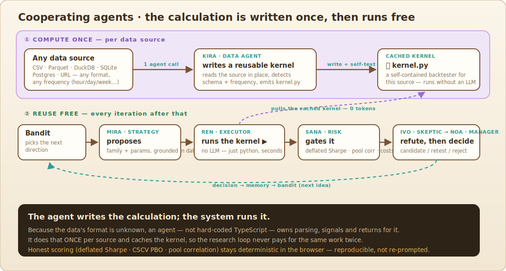
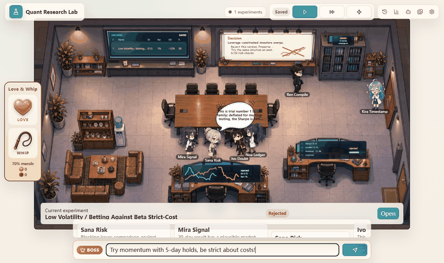
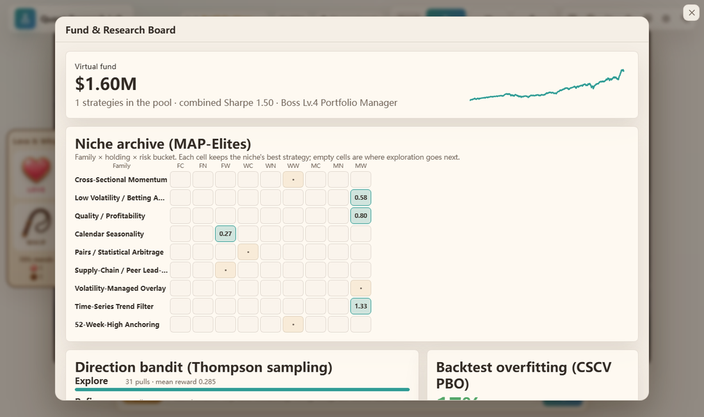
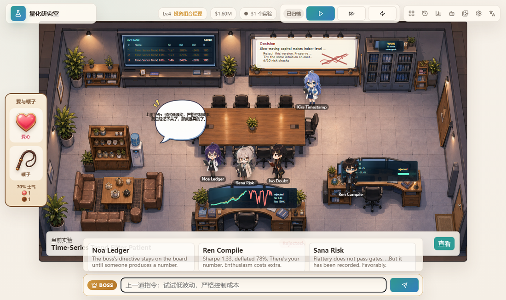
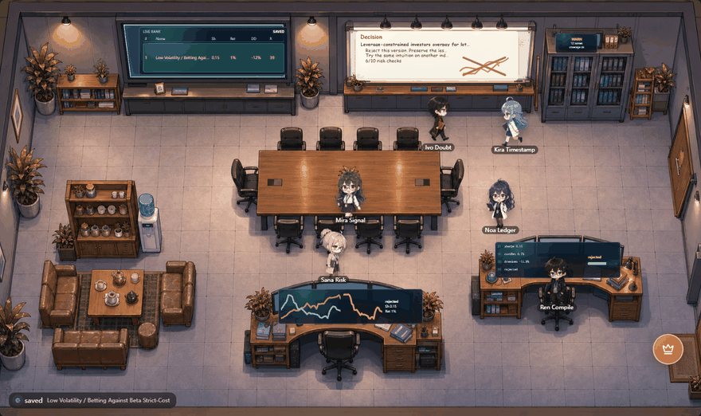
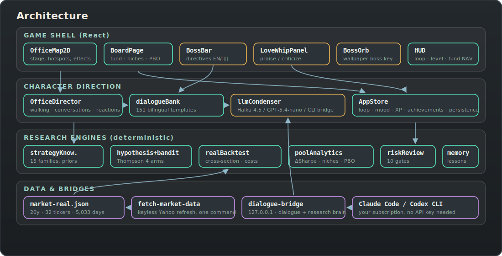

<div align="center">



<br/>

**An LLM-driven quant office where six researchers test real market ideas, keep score, and argue with the data.**

**English** · [简体中文](README.zh-CN.md)

[](https://react.dev)
[](https://www.typescriptlang.org/)
[](https://vite.dev)
[](#research-brain)
[](#bring-your-own-data)
[](#verify)
[](docs/REVIEW.md)
[](#desktop-mode)
[](LICENSE)


*A run in the office: the CLI proposes a hypothesis, the bandit picks a direction, the backtester uses real prices, risk gates vote, and the desk records the result.*

</div>

---

## Quick start (one click)

No finance knowledge needed. On Windows, **double-click `start.cmd`** in the project
folder. It installs dependencies the first time, then opens two small windows (the
**engine** and the **app**) and your browser at `http://127.0.0.1:5173`.

On the main screen, press **“Start investing”** on the purple **AI Quant Autopilot**
banner. The AI then researches strategies, backtests each on 20 years of history, and
paper-invests the winners for you — racing ~10 strategies and replacing the losers
automatically. Open the **Horse Race** tab to watch. You can close the browser
anytime; it keeps running in the engine window. Close the two windows to stop.

Prefer to run it by hand?

```
npm install
npm run dialogue-bridge      # the engine (keep open). For live paper trading:
                             #   set QRL_ALPACA_KEY_FILE to your Alpaca paper keys file first
npm run dev                  # the app  → open http://127.0.0.1:5173
```

It's all **paper / simulated money** — there is no live-money path anywhere. A free
Alpaca paper account ([alpaca.markets](https://alpaca.markets)) is optional and only
needed if you want it to place simulated orders; without keys it still researches,
backtests, and races.

---

## What This Is

Quant Research Lab is an office sim wrapped around a quant research loop. Claude Code or Codex reads the active dataset through a local bridge, proposes a strategy, and the browser runs the rest of the desk: data checks, cross-sectional backtest, risk review, debate, decision, and memory.

It ships with 20 years of US equity prices. You can also use a CSV, a remote file, or a large local source that should stay outside the browser.

The important part is not the animation. It is the audit trail:

- every signal is tested with bar `t` information earning bar `t+1` returns;
- costs, turnover, drawdown, random baselines, pool correlation, and deflated Sharpe are checked every run;
- the desk records family lessons, lineage, MAP-Elites niches, and decay;
- promoted candidates are judged by what they add to the combined fund, not by a pretty isolated chart.

Historical simulations only. No brokerage connection. Not investment advice.

### What's measured vs. illustrative

A senior-quant review (3 rounds, **4.5 → 8.4 → 9.0 / 10**) plus a self-honesty audit
pushed the calculation layer to be honest about its own limits — the full record,
including the precise difference between the strict pool gate and the looser deploy
gate, is in [docs/REVIEW.md](docs/REVIEW.md):

- **Measured from data** — cross-sectional backtest (no lookahead: bar `t` signal earns `t+1`), signals **winsorized + sector/beta-neutralized before ranking**, costs on turnover, Sharpe/Sortino/Calmar/PSR, Alphalens **IC (with a separate out-of-sample IC, and the admission gate requires OOS IC — no in-sample fallback)**, deflated Sharpe, purged + embargoed walk-forward, regime split **by the benchmark** (not by the strategy's own P&L), and a **measured random-rank baseline** on the in-browser engine (the bridge/agent return-series path can't reconstruct a random portfolio, so that check **abstains** rather than passing on an assumed 0). Every leaf formula is checked against the Python `empyrical`/`scipy`/`statsmodels` stack (`scripts/quant_reference`).
- **Capacity now measured** — the bundled dataset carries **OHLCV (volume + adjusted high/low)**, so `maxDeployableCapital` is computed from real **median ADV × 5% participation ÷ turnover**, and volume factors (**Amihud illiquidity**, **low-turnover/liquidity premium**, **Parkinson range-volatility**) are tradable. Market-impact/spread/borrow are still modelled (no live quote feed) and stay flagged.
- **Still illustrative** — execution-stress, latency, and partial-fill numbers (no microstructure feed); on a close-only upload (no volume) capacity falls back to the illustrative scaffold.
- **Not promotable** — a family the active dataset cannot actually backtest (e.g. a news/earnings factor on price-only data) runs the mock simulator for illustration only, is labelled **"Illustrative — no real data"**, and is **never** scored, pooled, counted in NAV, or promoted.

### Costs & richer data

- **Transaction costs** are no longer a flat commission: the backtest pays
  commission + half bid-ask spread + square-root market impact + daily short-borrow,
  all widening for illiquid names (lower ADV) and sized point-in-time (no lookahead).
  See `src/engines/costModel.ts`.
- **Fundamentals + news (optional, FMP free key):** `node scripts/fetch-fundamentals.mjs`
  (with `FMP_API_KEY`) adds **point-in-time** quarterly fundamentals (P/E, P/B, ROE,
  margin, leverage) and recent news to the universe, enabling a real, backtestable
  **value + quality** factor (`fundamental_value`). It also writes the
  survivorship-free S&P 500 membership history + delisted list to `data/`.
- **Honest data limits:** truly survivorship-free *price* history for delisted names
  and historical *options* data are not available on free tiers — this reduces
  survivorship bias and adds real fundamentals/news, but is not a substitute for a
  paid survivorship-free database (Sharadar/Norgate) or an options-history feed.
  Without an FMP key, the value factor self-filters (no data → not traded).

## Meet The Desk

Each researcher owns one job.

| | Researcher | Desk | Signature line |
|:---:|---|---|---|
|  | **Mira Signal** | Strategy | *"This signal smells promising."* |
|  | **Ren Compile** | Engineering | *"If it runs, we are alive."* |
|  | **Sana Risk** | Risk | *"Pretty returns do not mean usable returns."* |
|  | **Ivo Doubt** | Skeptic | *"This may just be luck."* |
|  | **Noa Ledger** | Experiment manager | *"Stop arguing. Next iteration."* |
|  | **Kira Timestamp** | Data | *"Do not use future data."* |

## Bring Your Own Data

Pick a source in **Settings -> Data source**.

| Source | What it is | Where it runs |
|---|---|---|
| **Bundled** | 20y of daily adjusted closes for 32 US large caps | Browser |
| **Upload CSV / JSON** | Long format (`date,ticker,close[,industry]`) or wide format (`date` plus one ticker per column) | Browser |
| **Remote URL** | CSV or JSON, if the server allows CORS | Browser |
| **Large local file / database** | Parquet, DuckDB, SQLite, Postgres, a big file, or a URL | CLI bridge |

Large sources stay where they are. The bridge asks the CLI to inspect the file or database, compute the return series, and send back only the results needed by the browser. That keeps big panels and private datasets out of the client.

Any timestamp frequency is allowed. Daily, hourly, minute, tick, weekly, and monthly bars are annualized from the detected sampling interval instead of being forced into a daily assumption.

Refresh the bundled dataset:

```bash
node scripts/fetch-market-data.mjs
```

Use large-source mode:

```bash
QRL_ALLOW_DATA_TOOLS=1 npm run dialogue-bridge
```

## Research Loop

<div align="center">

</div>

The loop is deliberately plain:

1. Pick a research direction with a Thompson-sampling bandit.
2. Ask the CLI for a hypothesis grounded in the current data profile.
3. Pause for human review if that setting is enabled.
4. Run a no-lookahead cross-sectional backtest.
5. Attach the Workflow 2.0 audit.
6. Let the risk, skeptic, and manager roles decide what to do next.

## Research Workflow 2.0

Workflow 2.0 turns a proposed idea into a record the desk can inspect later. Each completed experiment now stores:

- a discovery card with phenomenon, universe, required data, and citations;
- a compiled signal with feature, lag, hold, rebalance rule, and formula;
- source credibility and novelty checks against known factors and prior failures;
- point-in-time data contracts;
- walk-forward windows, regime notes, decay, capacity, execution stress, feature-store quality, paper-trading status, baselines, and a research feed.

Enable **Human review before backtest** in Settings to stop after proposal. The boss can approve, reject, or edit the idea before the desk spends a real backtest on it.

## Research Brain

Research requires a local bridge connected to an authenticated CLI. The bridge binds to `127.0.0.1` and shells out to the tools already signed in on your machine.

| Backend | Auth | Used for |
|---|---|---|
| **Claude Code CLI** | Your subscription, no API key | Hypothesis, skeptic, strategy discovery, optional large-data work |
| **Codex CLI** | Your subscription, no API key | Same path, with `model_reasoning_effort` raised for data tasks |

Run the bridge while the app is open:

```bash
npm run dialogue-bridge
```

Dialogue is separate. The characters can speak from the offline bilingual template bank, or you can route conversation rewriting through the same bridge/API settings.

## Compute Once, Reuse

<div align="center">

</div>

When a large source is connected, Kira writes a reusable `kernel.py` for that source. The kernel knows the schema, frequency, and strategy formulas. After it is cached, Ren can run later backtests without asking the CLI to rebuild the calculation.

Scoring stays deterministic in the browser: deflated Sharpe, CSCV PBO, pool correlation, risk gates, and promotion rules are not re-prompted.

## Discover New Families

The knowledge base can grow during play. Press **Discover** in the HUD or write a directive such as `research options-skew factors`. The bridge asks the CLI to read recent papers, working papers, financial news, and institution notes, then returns structured strategy families with citations.

Accepted discoveries are added to the knowledge base and shown on the Fund & Research Board. On bridge datasets, the cached kernel is regenerated so new formulas can be tested.

## You Are The Boss

<div align="center">

</div>

- **Directive bar:** type English or Chinese instructions. The next idea is biased toward your family, horizon, or strictness hint.
- **Love:** praise a researcher to raise morale and loosen exploration.
- **Whip:** criticize a researcher. Whipping risk makes the promotion gate stricter.
- **Click the office:** the leaderboard, data cabinet, whiteboard, meeting table, and workstations open live panels.

## Fund Board

<div align="center">

</div>

The meeting table opens the Fund & Research Board:

- virtual fund NAV from the candidate pool;
- MAP-Elites niche grid;
- bandit posterior state;
- CSCV probability of backtest overfitting;
- latest Workflow 2.0 audit summary.

The game layer adds XP, 10 boss titles, 16 achievements, confetti on promotion, rare office events, and wallpaper mode.

## Bilingual

<div align="center">

</div>

The globe button switches the UI, dialogue, achievements, board, data settings, and brain settings between English and Chinese. The directive bar accepts either language in either mode.

## Desktop Mode

<div align="center">

</div>

```bash
npm run build:wallpaper
```

The command creates a Lively Wallpaper zip and a Wallpaper Engine project. Wallpaper mode runs the loop without browser chrome and moves boss tools into a draggable crown orb.

| Host | How |
|---|---|
| [Lively Wallpaper](https://github.com/rocksdanister/lively) | Drag `quant-research-lab-wallpaper.zip` onto Lively |
| Wallpaper Engine | Create Wallpaper, then drag in `wallpaper-package/index.html` |
| Browser preview | Open `/?wallpaper=1` |

## Quick Start

```bash
npm install
npm run dev
npm run dialogue-bridge
```

Open the Vite URL, sign in to Claude Code or Codex, wait for the HUD dot to turn green, then press **Start research**.

## Architecture

<div align="center">

</div>

- `src/engines/dataset/`: provider factory, in-browser data provider, bridge provider, CSV parser, frequency detection.
- `src/engines/bridgeResearchAdapter.ts`: CLI-backed strategy proposal and skeptic path.
- `src/engines/researchWorkflow.ts`: Workflow 2.0 audit builder.
- `src/engines/`: strategy knowledge, hypothesis engine, bandit, real backtest, pool analytics, risk review, progression.
- `scripts/dialogue-bridge.mjs`: local bridge for dialogue, research, strategy discovery, dataset inspection, and bridge returns.
- `src/lib/office2d/officeDirector.ts`: walking, conversations, reactions, bubbles, and events.
- `work/RESEARCH_DESIGN_DOC.md`: research notes and formulas behind the scoring model.

## Verify

```bash
npm test
npm run build
```

Current suite: 28 tests covering real-data span, no-lookahead behavior, cost monotonicity, CSV long/wide parsing, provider backtests, bridge metrics, frequency detection, intraday annualization, bandit determinism, gates, workflow audit, and progression.

## Inside the app: one click does everything

No finance knowledge required. Start the engine + app (`start.cmd`, or the Quick
start above), then press the single glowing **green ▶** on the main screen. That one
button runs the whole thing as **one process**:

1. **Researches** strategies in parallel (Claude Code, with an Opus → Sonnet fallback
   that sleeps until the rate-limit resets),
2. **backtests** each on 20 years of history through the real engine — no lookahead,
   walk-forward, deflated Sharpe, out-of-sample IC — and only keeps the winners,
3. **paper-invests** them as a live **strategy horse race**: ~10 strategies each hold
   a sleeve of the account, marked to market on live prices; the worst is evicted
   every few hours and replaced by a freshly-validated challenger; the leader's book
   is mirrored to your Alpaca paper account.

The office researchers you see are a **live mirror** of that one process — the app
never calls the LLM a second time for the same job.

Tabs on the main screen:

- **🏇 Horse Race** — the live leaderboard (each strategy's pedigree, NAV, book, and evictions).
- **📈 Paper Trading** — validate a strategy on history, deploy it if it passes, and watch its **1 / 5 / 10-day** P&L from your Alpaca paper account.
- **🔬 Strategy Lab** — click any strategy to see *how* its signal is derived (phenomenon → signal → neutralize → rank → hold), then tweak it with a boss command.

All **paper / simulated money** — there is no live-money path anywhere.

## Trade it from the command line

If you'd rather drive it from a terminal — both simulated, no real money. The flow is
**backtest on history → only trade if it passes**. Both tools run cross-sectional
momentum, **positive-momentum only**, with a **trend filter** (invest only when SPY
is above its 200d moving average, else hold cash). The paper connector first
**validates the strategy on history through the real lab engine** (no-lookahead
backtest + walk-forward + deflated Sharpe + out-of-sample IC) and **refuses to trade
unless it passes**.

Universe: the bundled set is 60 names (20y); pass `--universe=large` (after
`node scripts/fetch-universe.mjs`) for a **~513-name S&P 500 + NASDAQ-100** set.
The wider universe is materially stronger out-of-sample:

| Universe | OOS Sharpe | OOS IC t-stat | Max drawdown |
|---|---|---|---|
| 60 names | 0.92 | 0.88 | −39% |
| 513 names (512 + SPY) | **1.55** | **2.08** | **−18%** |

(The 513-name figures use 5y of data, 2021–2026; see the survivorship caveat below.)

**1. Local simulator (offline, runs instantly):** replays the bundled real OHLCV
data bar-by-bar against a virtual $100k account, no lookahead, and a **flat
per-side commission** (no slippage / market impact / short borrow — optimistic),
and reports P&L vs SPY buy-and-hold. Its headline Sharpe is full-period in-sample,
not the gated out-of-sample edge.

```
node scripts/fetch-universe.mjs                              # build the 513-name universe (local, ~21MB, gitignored)
node scripts/paper-trade-sim.mjs --universe=large --top=12   # trend-filtered, wide universe
node scripts/paper-trade-sim.mjs --top=8 --noregime          # always-invested, bundled 60
```

Example (513 names, 2024-06 → 2026-06): trend-filtered top-12 $100k →
**$313,065 (+213%)** at Sharpe 1.70. (Caveat: that window was an exceptional
momentum/semis bull and the list is *current* constituents, so it carries
survivorship lift — the 5y **out-of-sample** validation, Sharpe 1.55 / IC t 2.08,
is the more trustworthy "does it generalize" figure.)

**2. Alpaca paper trading (a real simulated market with virtual money):** free —
sign up at [alpaca.markets](https://alpaca.markets) (email only), open the Paper
Trading dashboard, and create paper API keys. The connector **only ever uses the
paper endpoint** (`paper-api.alpaca.markets`) — it has no live-trading code path —
and reads your keys from the environment or a local key file (never printed).

```
# keys from env:
$env:APCA_API_KEY_ID="..."; $env:APCA_API_SECRET_KEY="..."
# or from a file (KEY=VALUE / JSON / two tokens), kept outside the repo:
$env:QRL_ALPACA_KEY_FILE="C:\path\to\keys.txt"

node scripts/alpaca-paper.mjs status            # account equity, positions, open orders
node scripts/alpaca-paper.mjs targets           # regime + momentum targets (no orders)
node scripts/alpaca-paper.mjs rebalance --yes   # submit PAPER orders to the book
```

Not investment advice. Paper/simulated trading only.

## What Shipped

- [x] **One-click autopilot**: a single green ▶ runs research → backtest → paper-invest as **one process**; the office animation is a live mirror of it (no duplicate LLM calls). `start.cmd` launches the engine + app.
- [x] **Strategy horse race**: ~10 strategies researched in parallel, validated, and raced as virtual sleeves on live prices; the worst is evicted and replaced by a validated challenger; the leader is mirrored to your Alpaca paper account.
- [x] **In-app paper trading** (Alpaca, paper endpoint only): validate-on-history-then-deploy, with 1 / 5 / 10-day P&L; plus a Strategy Lab to inspect and edit each strategy's logic.
- [x] **Validated calculation core**: no-lookahead backtest with winsorized + sector/beta-neutralized signals, purged + embargoed walk-forward, deflated Sharpe, **out-of-sample IC admission gate**, measured random-rank baseline — all checked against the Python `empyrical`/`scipy`/`statsmodels` stack. Reviewed to **9/10** ([docs/REVIEW.md](docs/REVIEW.md)).
- [x] **OHLCV data**: volume + adjusted high/low → Amihud illiquidity, low-turnover, and range-volatility factors, plus a **measured** capacity model (median ADV). ~513-name S&P 500 + NASDAQ-100 universe.
- [x] Research Workflow 2.0: discovery cards, compiled signals, source credibility, novelty, point-in-time contracts, validation, baselines, and research feed.
- [x] Claude Code / Codex research brain through a local bridge (Opus → Sonnet fallback with rate-limit-reset handling).
- [x] Bring-your-own data: upload, remote URL, large local files, and databases; frequency-aware metrics (tick → monthly); cached large-data kernels.
- [x] Thompson bandit, pool delta-Sharpe reward, MAP-Elites niches, CSCV PBO.
- [x] Game layer: XP, titles, achievements, fund NAV, office events, confetti, EN / 中文.

Next ideas: a packaged one-file desktop app (engine + UI in one window), fundamentals for the quality family, and small/mid-cap universe de-survivorship.

## Credits

| | |
|---|---|
| **Shoral Rat** ([@shoal-rat](https://github.com/shoal-rat)) | Concept, direction, art, and project ownership |

Strategy priors cite their original papers inside [`src/engines/strategyKnowledge.ts`](src/engines/strategyKnowledge.ts).

**Disclaimer:** historical simulations only. No brokerage connection. Not investment advice.
