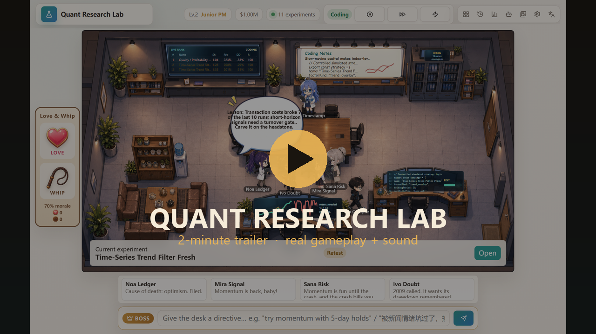

<div align="center">


<br/>

**Six chibi researchers mine 20 years of real market data for alpha — propose, backtest, gate, debate, promote — and answer to exactly one person: you, the BOSS.**

**English** · [简体中文](README.zh-CN.md)

[](https://react.dev)
[](https://www.typescriptlang.org/)
[](https://vite.dev)
[](#a-research-loop-that-earns-its-numbers)
[](#verify)
[](#fully-bilingual)
[](#-put-it-on-your-desktop)
[](LICENSE)

<a href="https://github.com/shoal-rat/quant-research-lab/blob/main/docs/media/promo.mp4"></a>

🎬 **[▶ Watch the 2-minute trailer — with narration & sound](https://github.com/shoal-rat/quant-research-lab/blob/main/docs/media/promo.mp4)** · real gameplay from start to finish *(plays in your browser on GitHub)*

<br/>


*One real research iteration: a Thompson bandit picks the direction, the whiteboard gets a hypothesis, the backtest runs on 20 years of daily prices, risk gates fire, and the desk argues about it at the meeting table. Every number in every speech bubble is real.*

</div>

---

## What is this?

A **cozy anime office sim that is secretly a serious autonomous research loop**. The six researchers below run the full cycle by themselves — hypothesis → data audit → real cross-sectional backtest → mechanical risk gates → debate → promote or bury — on **bundled real data: ~5,000 trading days of daily adjusted closes for 32 US large caps (2006 → 2026)**. You don't write code to play it; you manage *them*.

It is honest where research sims usually cheat:

- 🧠 **Ideas come from a knowledge base, not a name generator** — 14 documented equity families (momentum, PEAD, low-vol/BAB, pairs, lead-lag, seasonality…) with literature-grounded net-of-cost Sharpe priors, failure modes, and parameter ranges.
- 🎰 **A Thompson-sampling bandit picks the research direction** — `explore / refine / repair / recombine`, with posteriors learned from how much each direction actually moved the fund.
- 🛡️ **Promotion is gated mechanically** — Bailey–López de Prado **deflated Sharpe** against the desk's global trial count, a WorldQuant-style **alpha-pool correlation penalty**, cost/turnover/drawdown/baseline checks. The risk officer reads the verdict; she never overrides it.
- 📉 **Candidates are scored by pool ΔSharpe** — a strategy is only worth what it adds to the fund's combined daily-return series, not its solo stats.
- 🪦 **The desk remembers** — per-family lessons, lineage (v2/v3 children of promising parents), a MAP-Elites niche archive, and edge decay when the team re-mines the same family. Just like the real factor zoo.

Historical simulations only — no brokerage, no investment advice.

## Meet the desk

| | Researcher | Desk | Signature line |
|---|---|---|---|
| 🔴 | **Mira Signal** | Strategy | "This signal smells promising." |
| 🔵 | **Ren Compile** | Engineering | "If it runs, we are alive." |
| 🟤 | **Sana Risk** | Risk | "Pretty returns do not mean usable returns." |
| ⚪ | **Ivo Doubt** | Skeptic | "This may just be luck." |
| 🟢 | **Noa Ledger** | Experiment manager | "Stop arguing. Next iteration." |
| 🟣 | **Kira Timestamp** | Data | "Do not use future data." |

They walk between desks, gossip about whoever you just whipped, argue four-ways at the meeting table, and quote their actual backtest numbers while doing it.

## A research loop that earns its numbers

<div align="center">

</div>

The bundled dataset lives in `public/assets/data/market-real.json` (32 tickers · ~5,000 days · adjusted closes). Refresh it any time, keylessly:

```bash
node scripts/fetch-market-data.mjs     # pulls 20y of daily data from Yahoo's public chart API
```

Backtests are genuinely cross-sectional: signals computed at day *t* earn day *t+1* returns (no lookahead), long/short rank buckets, turnover-based costs, and a chronological in-sample / out-of-sample split. Prefer the old synthetic simulator? Flip **Settings → Data source** — both run the same gates.

## You are the BOSS

<div align="center">

</div>

- **🗣️ Directive bar** — type an order in English or Chinese (*"try momentum with 5-day holds"*, *"被新闻情绪坑过了，换条路"*). The office snaps to attention, argues about it, and the next hypothesis is steered toward your families, horizons, and strictness.
- **❤️ Love** — praise a researcher: hearts burst, morale rises, the strategy desk explores more boldly.
- **🪢 Whip** — criticize one: the team gossips about it, and whipping the risk desk *genuinely raises the promotion bar* (stricter status thresholds, harsher gates).
- **🖱️ Click anything** — leaderboard screen, data cabinet, whiteboard, meeting table, and workstations all open live panels. The office is the only screen; there is no website wrapped around it.

## Run a fund, not a screensaver

<div align="center">

</div>

- **Virtual fund NAV** in the HUD, marked off the candidate pool's combined real-data performance.
- **Boss XP and ten titles** — every experiment, candidate, directive, and praise/whip earns XP; climb from *Intern Boss* to *量化教父*.
- **16 achievements** — from *Graveyard Keeper* (10 rejections) to *Fund Sharpe > 1*, with unlock toasts and a trophy wall.
- **Fund & Research Board** (click the meeting table): pool equity curve, the MAP-Elites niche grid, the bandit's live posteriors, and the desk's CSCV **probability of backtest overfitting**.
- **Confetti** when a candidate is promoted; **rare office events** (regulator visits, coffee crises, journal rejections) keep the place alive between runs.

## Fully bilingual

<div align="center">

</div>

Flip the globe icon in the HUD and the entire game — UI, dialogue, achievements, board — switches between English and 中文. Directives are understood in both languages either way.

## 🖥️ Put it on your desktop

<div align="center">

</div>

```bash
npm run build:wallpaper
```

Produces a ready-to-drag **Lively Wallpaper zip** and a **Wallpaper Engine** project. The loop auto-runs chrome-free, and the boss tools collapse into a **draggable floating crown orb** — tap it for Love, Whip, and the directive input right on your desktop. It pauses automatically behind fullscreen apps.

| Host | How |
|---|---|
| [Lively Wallpaper](https://github.com/rocksdanister/lively) (free) | drag `quant-research-lab-wallpaper.zip` onto the Lively window |
| Wallpaper Engine (Steam) | Create Wallpaper → drag `wallpaper-package/index.html` |
| Just a browser | open `/?wallpaper=1` |

## Quick start

```bash
npm install
npm run dev        # open http://127.0.0.1:5173
```

Press **▶ Start** and watch the desk work. Give it a directive. Whip someone. Open the board.

## Two pluggable brains

**Dialogue.** Conversations are always generated locally from an authored bank of **151 bilingual script templates (~460 lines)** that condition on live research context — experiment status, deflated-Sharpe odds, lineage, directives, morale — and interpolate the real numbers. Free and offline. Optionally route them through a small model for personalized rewrites (silent local fallback on any failure):

| Backend | Auth | Model |
|---|---|---|
| Anthropic API | your API key, browser-direct | `claude-haiku-4-5` (~$0.002/chat) |
| OpenAI API | your API key, browser-direct | `gpt-5.4-nano` (~$0.0004/chat) |
| **Claude Code CLI** | your existing subscription — no key | `claude-haiku-4-5` |
| **Codex CLI** | your existing subscription — no key | account default, low reasoning |

**Research.** Set **Settings → Research brain** to a CLI backend and the *hypothesis itself* — family, parameters, pitch — comes from a real model that reads the desk's memory and recent results, validated against the knowledge base before it touches the loop.

Both go through one tiny local bridge that shells out to your already-authenticated CLI:

```bash
npm run dialogue-bridge     # keep running while you play; binds to 127.0.0.1 only
```

## Architecture

<div align="center">

</div>

- `src/lib/office2d/officeDirector.ts` — character brain: waypoint walking, conversation orchestration (gather → speak in turns → disperse), bubble anti-overlap, boss reactions, confetti.
- `src/engines/` — deterministic research engines: `strategyKnowledge`, `hypothesisEngine` + `banditEngine`, `realBacktestEngine`, `poolAnalytics` (ΔSharpe · MAP-Elites · CSCV PBO), `riskReviewEngine`, `researchMemory`, `progression`.
- `src/engines/dialogue/` — the 151-template bank + LLM condenser; `scripts/dialogue-bridge.mjs` — the CLI bridge.
- `work/RESEARCH_DESIGN_DOC.md` — the research synthesis behind the design (RD-Agent(Q), QuantEvolve, AlphaGen, FinMem/FinCon, Bailey–López de Prado, Harvey–Liu–Zhu, McLean–Pontiff) with exact formulas.

## Verify

```bash
npm test           # 17 engine tests: real-data span, no-lookahead, cost monotonicity, bandit determinism, ΔSharpe/PBO sanity, niche elitism, gates, progression
npm run build      # tsc + vite
```

## v2.0 — the whole roadmap shipped

- [x] **20 years of real market data** + real cross-sectional backtester + real pool correlations
- [x] **Thompson-sampling direction bandit** (RD-Agent(Q)) with history-derived posteriors, narrated in each idea's reasoning trace
- [x] **Pool-level ΔSharpe reward** (AlphaGen) — strategies scored by what they add to the fund
- [x] **MAP-Elites niche archive** (QuantEvolve) — family × horizon × risk grid steering exploration to open cells
- [x] **CSCV probability of backtest overfitting** on the board
- [x] **Real LLM research loop** via Claude Code / Codex CLI
- [x] **Game layer** — XP, 10 titles, 16 achievements, fund NAV, office events, confetti

Next ideas: fundamentals for the quality family, in-game data refresh, multi-desk competition.

## Contributors

| | |
|---|---|
| **Weike Zhang** ([@shoal-rat](https://github.com/shoal-rat)) | The Boss · concept & direction · art assets |
| **Claude** (Anthropic) | full-stack implementation · research synthesis · character writing |

Built with Claude Code. Character art, office renders, and the Love & Whip set are project-generated assets. Strategy priors cite their original papers inside [`src/engines/strategyKnowledge.ts`](src/engines/strategyKnowledge.ts).

**Disclaimer:** historical simulations only · no brokerage connection · not investment advice.
