<div align="center">

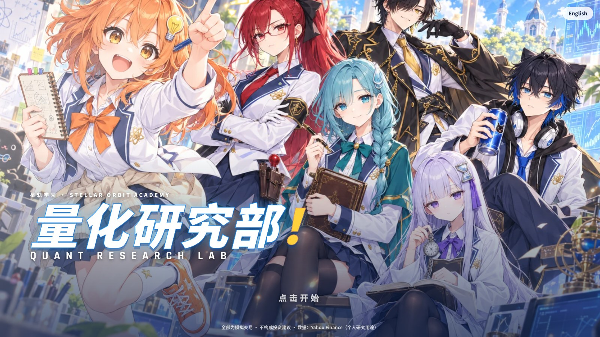

# Quant Research Lab · 量化研究部

**Six members of an academy club propose trading ideas with an LLM, put every one of them through honest statistics, and paper-trade the survivors.**

**English** · [简体中文](README.zh-CN.md)


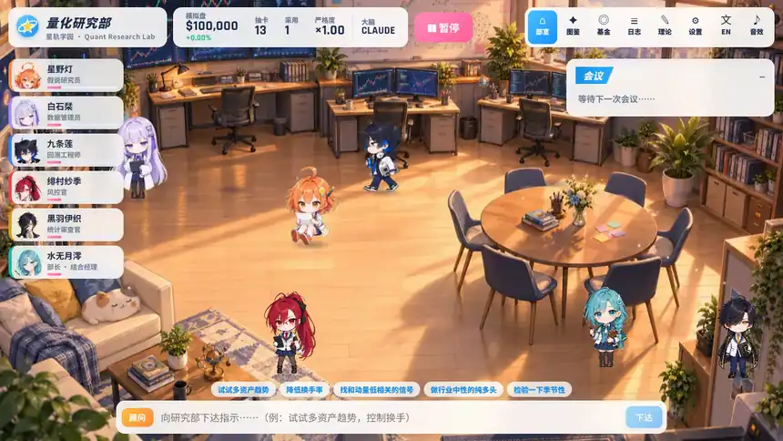

<sub>One research meeting, replayed at 2x: title card → the club gathers → hypothesis → data check → backtest reveal → risk and skeptic review → verdict cut-in → rarity reveal.</sub>

</div>

---

## What it is

An anime research game wrapped around a serious systematic-research engine.

- **You are the club's Advisor.** Every research meeting is one *pull*: Akari proposes a hypothesis, Shiori checks it can't see the future, Ren backtests it, Saki audits costs and drawdowns, Iori attacks it with statistics, and Mio adopts or rejects it.
- **Rarity is computed, not rolled.** N / R / SR / SSR comes from the *expected live Sharpe*: the backtest Sharpe after empirical-Bayes shrinkage toward every strategy the club has tried. More pulls, harder shrinkage, higher bar. The market has no pity system.
- **Adopted strategies join the club fund**, allocated by Bayesian mean-variance, then run forward on real prices in a paper book: orders after the close, fills at the next open — the same timeline as the backtest.

v4 is a ground-up rebuild: a new Python quant engine, a new cast and all-new art, and a chibi club room plus visual-novel storyboard instead of the old office map.

<div align="center">
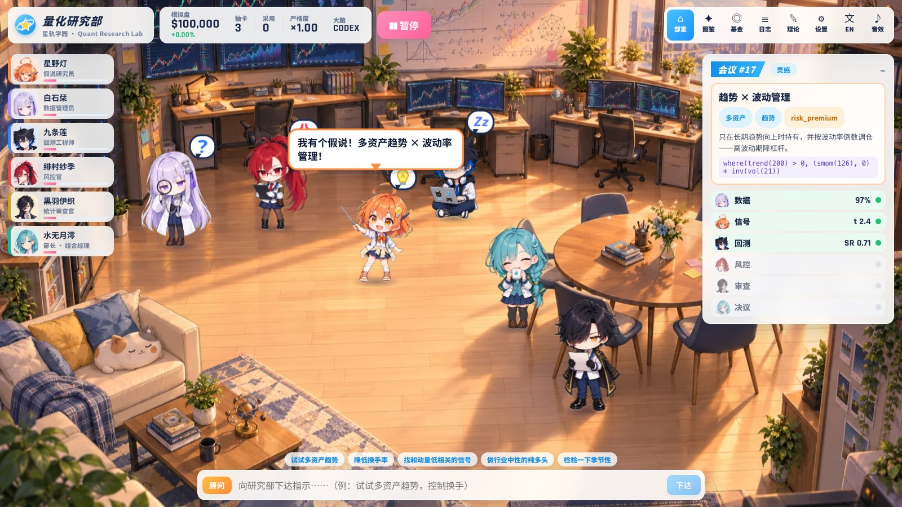
<sub>The club room. Two-heads-tall members work at their stations; the right panel is the live review pipeline. Click a member to pat their head — or bonk it with a squeaky hammer.</sub>
</div>

## Quick start

Needs [uv](https://docs.astral.sh/uv/) (Python) and Node.js 20+.

```bash
./start.sh
```

```bash
start.cmd
```

On first launch Shiori downloads market data (multi-asset and sector ETFs in ~20 s, the point-in-time S&P 500 in ~2 min) and the browser opens `http://127.0.0.1:8765`. Click the title screen, then **▶ Start research**.

Development (hot reload):

```bash
cd engine && uv run qrl serve
```

```bash
cd app && npm install && npm run dev
```

**Research brain** ladder: Claude Code CLI (your subscription, no API key) → Anthropic API (if `ANTHROPIC_API_KEY` is set) → Codex CLI → offline. Offline, the club keeps going on the mechanism library and the genetic miner.

## The club

<div align="center">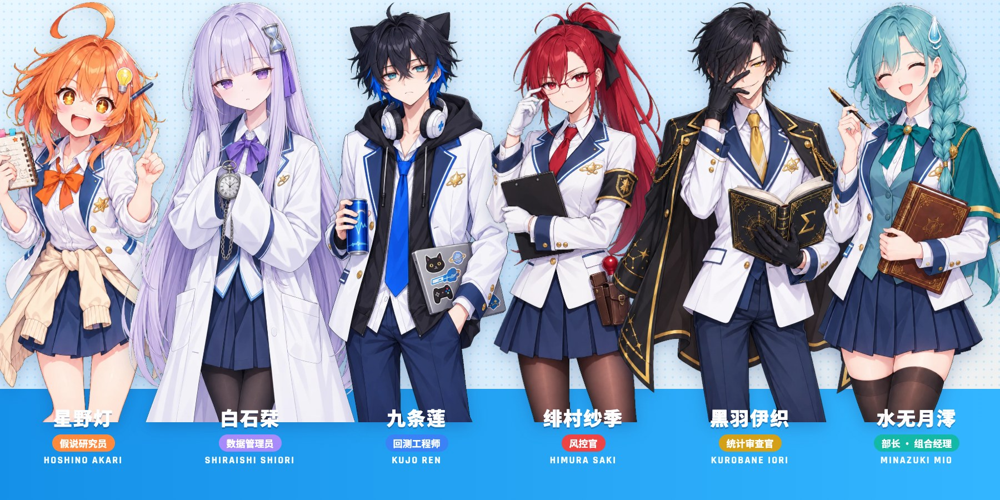</div>

| Member | Owns | What they check in a meeting |
|---|---|---|
| **Hoshino Akari** 1st year | Hypothesis | Reads papers and news, turns ideas into formulas. Cries when rejected, back with a new one the next morning. |
| **Shiraishi Shiori** 2nd year | Data | Look-ahead fuzz test: truncates history twice and recomputes; no past value may change. Coverage and survivorship. |
| **Kujo Ren** 2nd year | Backtest | Next-open fills, overnight/intraday split, spread, square-root impact, borrow, delisting haircuts. Runs on energy drinks. |
| **Himura Saki** 2nd year | Risk | How much of the edge costs eat, drawdown, capacity, year-by-year stability, one-year wonders. Bonk her and she gets stricter. |
| **Kurobane Iori** 3rd year | Statistics | Sharpe standard error, Deflated Sharpe, empirical-Bayes posterior, factor attribution, correlation with the fund. Chuunibyou — every line backed by math. |
| **Minazuki Mio** 3rd year | President · PM | Rules on the gate checklist and asks one question: is the fund better with this in it? |

Each member has 22 chibi poses and six knee-up portrait expressions:

<div align="center">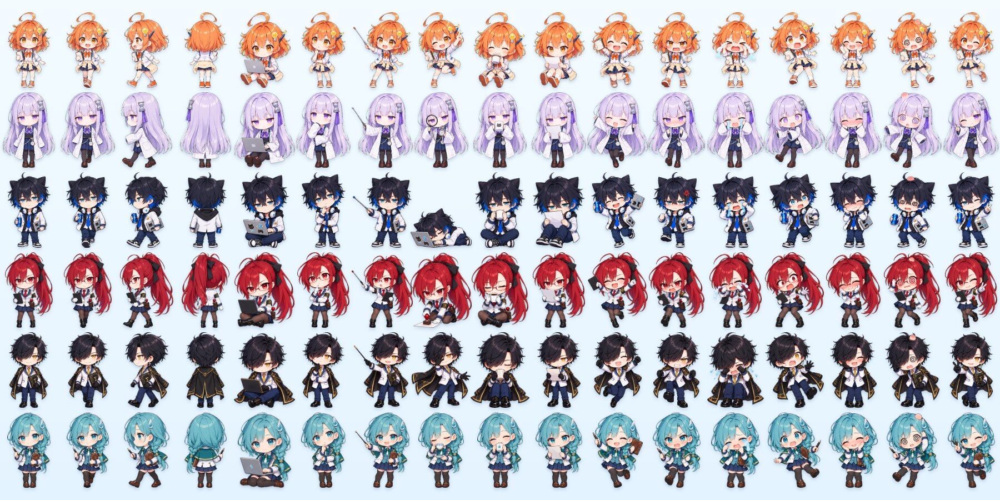</div>

## Storyboard

Every meeting plays with the same shot grammar, driven by the engine's live event stream (it speeds up when events back up):

| Shot | What happens |
|---|---|
| Title card | "Research Meeting #N" slanted band sweeps across |
| Wide | Everyone walks to the round table (path-finding around furniture); each reviewer walks to their station and acts it out with speech bubbles and manga emotes |
| VN | Two portraits face off; the speaker lights up and changes expression, the listener dims |
| Reveal | Backtest card: the equity curve draws itself, the Sharpe counts up |
| Cut-in | Verdict: speed-line band, close-up, a 採用 / 保留 / 却下 hanko stamp slams down, the screen shakes |
| Gacha | On adoption: light pillar and card flip; SSR gets a rainbow frame and confetti |

<table>
<tr><td>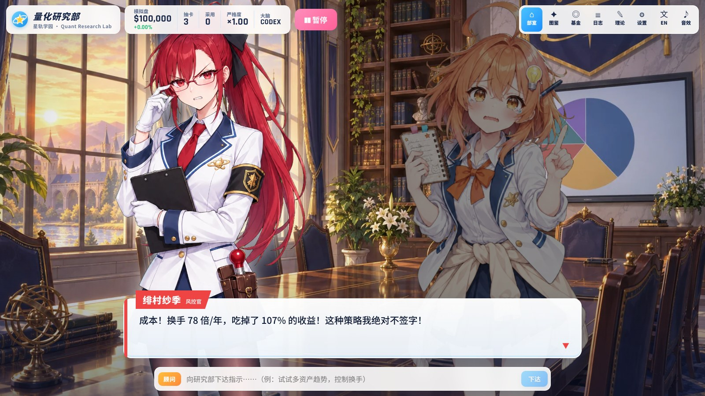</td><td>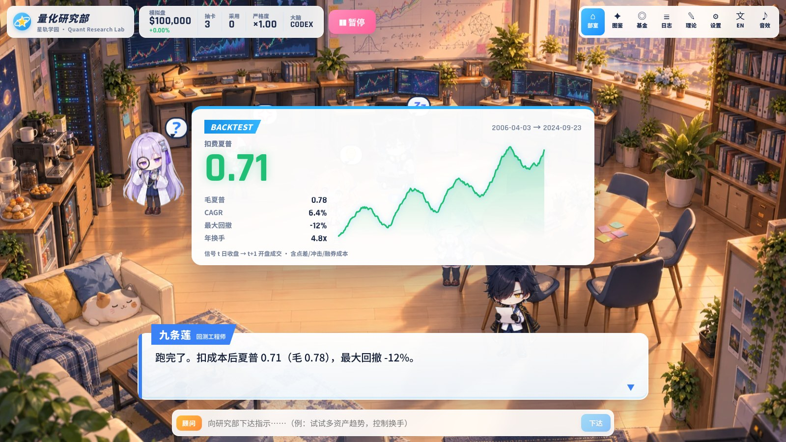</td></tr>
<tr><td>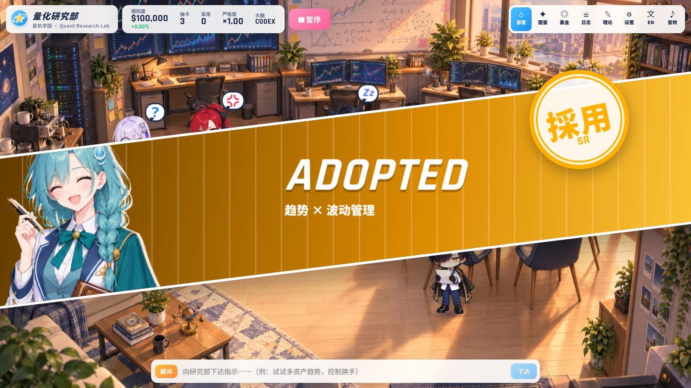</td><td>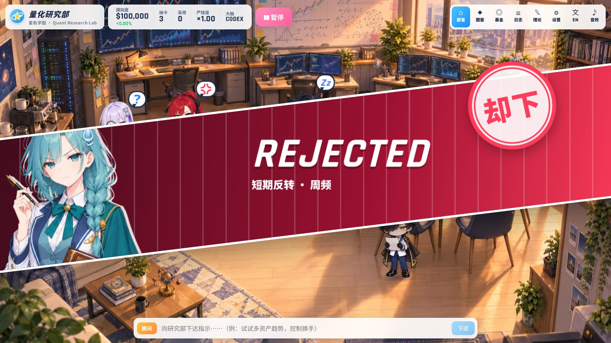</td></tr>
<tr><td>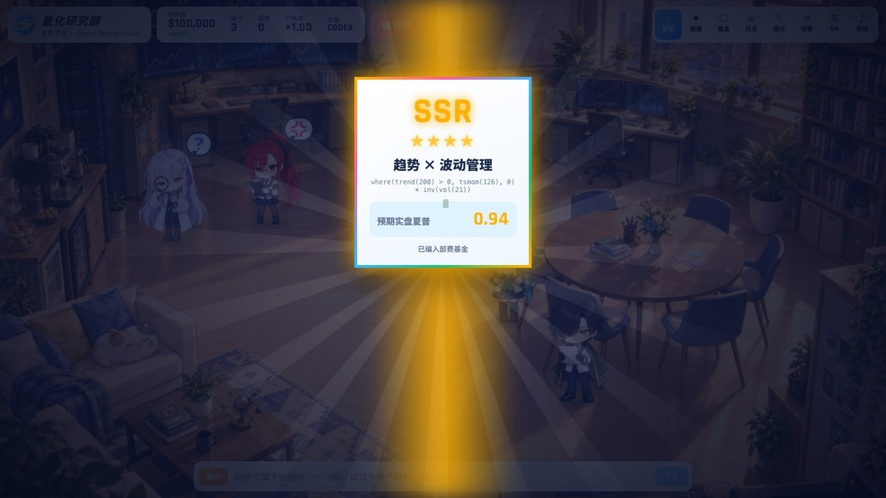</td><td>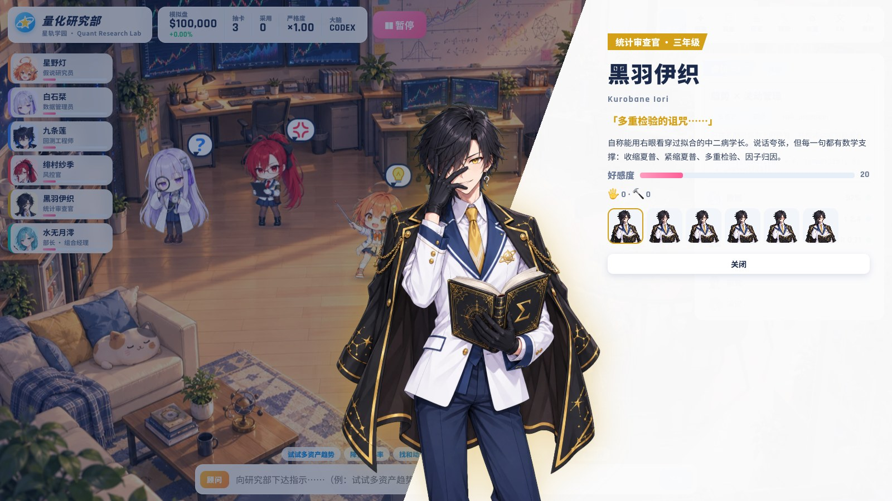</td></tr>
</table>

Any meeting can be replayed from the Log page.

## Investment doctrine

The club's four rules (the in-app Theory page has the full lecture notes):

1. **Mechanism first.** A signal must say why it pays: risk compensation, a behavioral error, or a structural friction. A formula without a story starts at a zero-Sharpe prior.
2. **Bayesian skepticism.** A backtested Sharpe is evidence, not a forecast. It is shrunk toward everything the club has tried.
3. **Implementation is the strategy.** Trade at the next open, pay spread, impact and borrow, respect capacity. A premium that exists only before costs does not exist.
4. **Portfolio, not heroes.** A strategy is worth its marginal contribution to the fund, not its standalone curve.

**Rarity:**

```
E[SR_live] = m + τ²/(τ² + se²) · (SR_backtest − m)
```

`m` and `τ²` are method-of-moments estimates from every comparable trial the club has run (blended with the mechanism prior at 20 pseudo-observations); `se` is the Sharpe standard error with skew and fat tails. If most pulls are noise, `τ²` is small and shrinkage is brutal.

**Gate checklist** (hard gates reject, soft gates send to reserve):

| Gate | Rule |
|---|---|
| Evidence | research-region Sharpe t-stat ≥ 2 |
| Consistency | train and validation Sharpe both > 0 |
| Costs | net Sharpe ≥ 50% of gross |
| Stability | ≥ 55% positive years, still positive without the best year |
| Deflation | DSR ≥ 0.9 with N = every pull (each miner evaluation included), deflated by average correlation |
| Posterior | E[SR_live] ≥ 0.25 and P(true Sharpe > 0) ≥ 85% |
| Novelty (soft) | correlation with every fund member < 0.7 |
| Survivorship (soft) | no significant size-factor tilt (the data is missing delisted names, mostly small ones) |
| Lockbox | the last two years are sealed and opened exactly once, after every other gate passes |

### What it found on real data

A fresh club pulling each library family once (2005 up to the lockbox; point-in-time S&P 500 and multi-asset ETFs):

| Family | Universe | Book | Gross SR | Net SR | E[live SR] | Costs bp/yr | Max DD | Verdict |
|---|---|---|---|---|---|---|---|---|
| Cross-sectional momentum | S&P 500 | L/S | 0.03 | −0.06 | 0.08 | 42 | −34% | reject N |
| Residual momentum | S&P 500 | L/S | 0.06 | −0.03 | 0.09 | 44 | −46% | reject N |
| Industry momentum | S&P 500 | L/S | 0.13 | 0.04 | 0.13 | 58 | −38% | reject N |
| Short-term reversal | S&P 500 | L/S | **0.82** | −0.06 | 0.10 | **673** | −35% | reject N |
| Low volatility | S&P 500 | L/S | −0.15 | −0.21 | 0.02 | 16 | −43% | reject N |
| 52-week high | S&P 500 | L/S | −0.05 | −0.15 | 0.02 | 58 | −48% | reject N |
| Lottery demand (MAX) | S&P 500 | L/S | −0.24 | −0.45 | −0.13 | 124 | −49% | reject N |
| Seasonality | S&P 500 | L/S | 0.16 | −0.05 | 0.06 | 90 | −32% | reject N |
| Overnight vs intraday | S&P 500 | L/S | 0.05 | −0.07 | 0.06 | 42 | −28% | reject N |
| Illiquidity | S&P 500 | L/S | 0.76 | 0.66 | 0.40 | 27 | −16% | reserve (size beta 0.99 → survivorship) |
| Time-series momentum | Multi-asset | trend | 0.43 | 0.39 | 0.35 | 20 | −13% | reject (t = 1.7) |
| Moving-average trend filter | Multi-asset | trend | 0.58 | 0.53 | 0.40 | 29 | −13% | **adopt R** |
| Risk parity | Multi-asset | trend | 0.50 | 0.49 | 0.40 | 5 | −15% | **adopt R** |
| Cross-asset rotation | Multi-asset | long-only | 0.21 | 0.20 | 0.22 | 15 | −32% | reject N |
| Sector rotation | Sector ETFs | long-only | 0.08 | −0.02 | 0.09 | 55 | −50% | reject N |
| Volatility-managed | Multi-asset | trend | 0.42 | 0.40 | 0.35 | 13 | −15% | reject (twin of the trend filter) |

This matches the literature: published cross-sectional anomalies in large caps are largely gone after real costs (short-term reversal has a 0.82 gross Sharpe and turns negative once you pay for 78× annual turnover), while cross-asset trend and risk parity still earn their keep with shallow drawdowns. Long-only stock selection is judged against an equal-weight basket traded on the same schedule, so the market's own drift never counts as skill.

Nothing here guarantees a profit. What the club can do is refuse to bet on noise and refuse to pay costs for premia that aren't there.

<table>
<tr><td>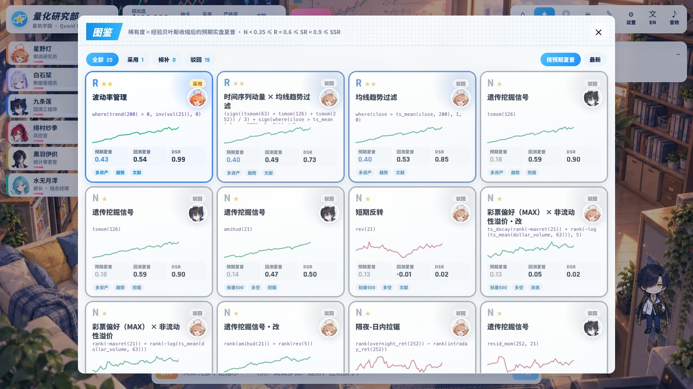</td><td>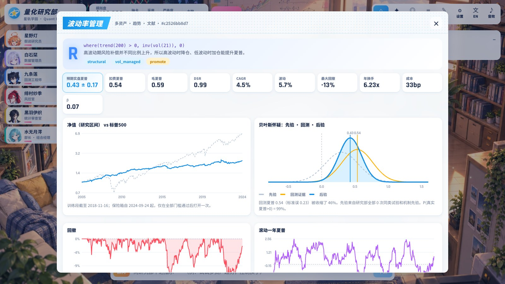</td></tr>
<tr><td>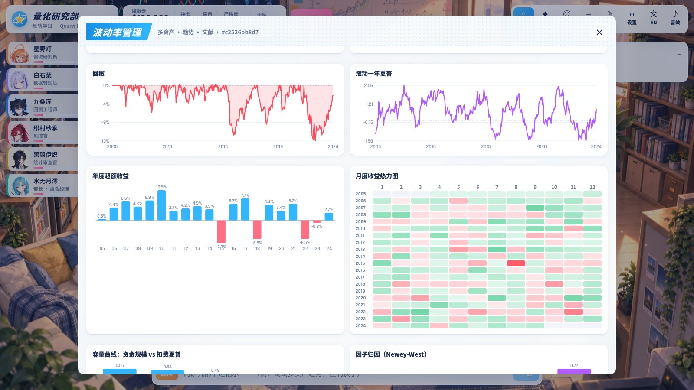</td><td>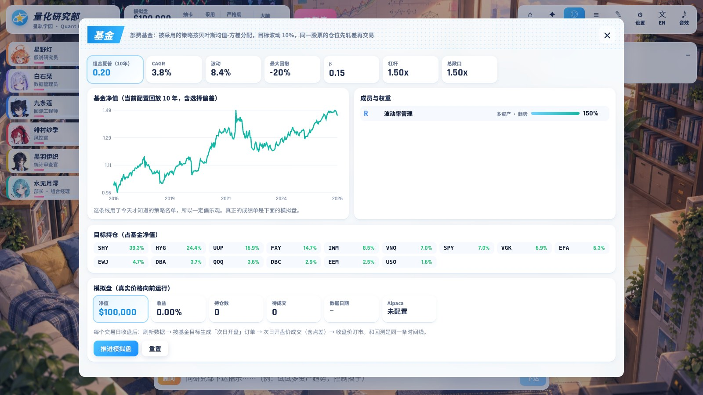</td></tr>
</table>

## Engine

```
engine/qrl
├── data/        Yahoo daily bars (total-return adjusted), point-in-time S&P 500, ETFs, T-bill yield
├── alpha/       safe expression language (ast whitelist) + vectorized, trailing-only operators
├── portfolio/   score → book: long/short, long-only quantile, risk-sized trend; vol targeting
├── backtest/    daily simulator: next-open fills, overnight/intraday split, drift, cash at the
│                bill rate, borrow fees, delisting haircuts, capacity curve
├── stats/       Sharpe SE, PSR, DSR, empirical-Bayes posterior, Newey-West IC, CSCV PBO, attribution
├── research/    evaluation pipeline, gates, trial registry (SQLite), mechanism library, LLM proposals,
│                genetic miner, refinements, Thompson bandit, fund
├── live/        internal paper book (next-open fills) + optional Alpaca paper endpoint
├── cast/        characters and lines (zh/en; every number in a line comes from the audit)
└── server/      FastAPI + WebSocket stream; refreshes data and advances the paper book after the close
```

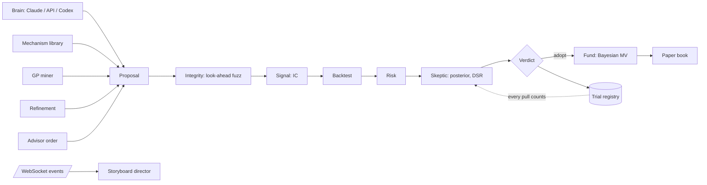
```mermaid
flowchart LR
  B[Brain: Claude / API / Codex] --> P[Proposal]
  L[Mechanism library] --> P
  M[GP miner] --> P
  R[Refinement] --> P
  A[Advisor order] --> P
  P --> I[Integrity: look-ahead fuzz] --> S[Signal: IC] --> BT[Backtest] --> RK[Risk] --> SK[Skeptic: posterior, DSR] --> V{Verdict}
  V -->|adopt| F[Fund: Bayesian MV] --> PB[Paper book]
  V --> REG[(Trial registry)]
  REG -. every pull counts .-> SK
  E[/WebSocket events/] --> UI[Storyboard director]
```

**Data.** The S&P 500 universe is point-in-time (removed members included): a stock can only be traded on days it was actually in the index, which removes most of the "backtest today's winners" bias. About 300 historical members that were delisted have no Yahoo history and are still missing — hence the survivorship gate, and the note on every report.

**Costs.** Half-spread = 0.15 × σ / √(ADV / $1M), floored at 1 bp for stocks and widening in crises; impact = 0.7 × σ × √(traded / ADV); borrow 0.3%/yr (3% hard-to-borrow). At retail size impact is negligible; the capacity curve shows how Sharpe decays with scale.

**Alpha language.** e.g. `rank(resid_mom(252, 21)) - 0.5 * rank(vol(63))` or `where(trend(200) > 0, tsmom(126), 0) * inv(vol(21))`. The LLM and the miner can only write expressions like these, never code, and every new formula goes through the look-ahead fuzz test.

**Tests.** `cd engine && uv run pytest` — 74 tests on synthetic data, including "a cheating operator is caught" and "a return that lands in the overnight gap cannot be captured at the next open".

## App

```
app/src
├── stage/     chibi club room: imperative 60 fps engine (path-finding, hop-walk, facing, depth scale,
│              breathing), daylight grading on the US market clock
├── story/     storyboard director + dialogue box / VN / title card / reveal / cut-in / gacha reveal
├── hud/       top bar, roster, meeting board, Advisor command bar
├── screens/   codex, tearsheet, fund, log (with replay), theory, settings, profiles, title screen
└── lib/       API, state, zh/en strings, synthesized sound effects (WebAudio, no audio files)
```

## Art

Everything was redrawn for v4: character designs, a cast lineup, 6 × 6 portrait expressions, 6 × 22 chibi poses, five backgrounds and a key visual. Generated on green screen with Codex image generation (every prompt is in `art/jobs.py`); `art/process.py` soft-keys, despills, slices the chibi grids, normalizes scale to the standing pose, anchors feet, and crops each character's expressions with one shared box so swaps never jitter.

```bash
QRL_ART_WORK=~/qrl-art python3 art/gen.py 'chibi-*'
```

```bash
uv run --with pillow --with numpy --with scipy python art/process.py ~/qrl-art/raw app/public/art
```

## Notes

- Paper / simulated trading only; there is no live-money code path. Not investment advice.
- Market data comes from Yahoo Finance for personal research use; it is not redistributed with the repo and is downloaded locally on first run.
- v3 and earlier live under the tag `v3-final`.

## Credits

| | |
|---|---|
| **Shoral Rat** ([@shoal-rat](https://github.com/shoal-rat)) | Concept, direction, project ownership |

Strategy references are in `engine/qrl/research/knowledge.py` and on the in-app Theory page.
