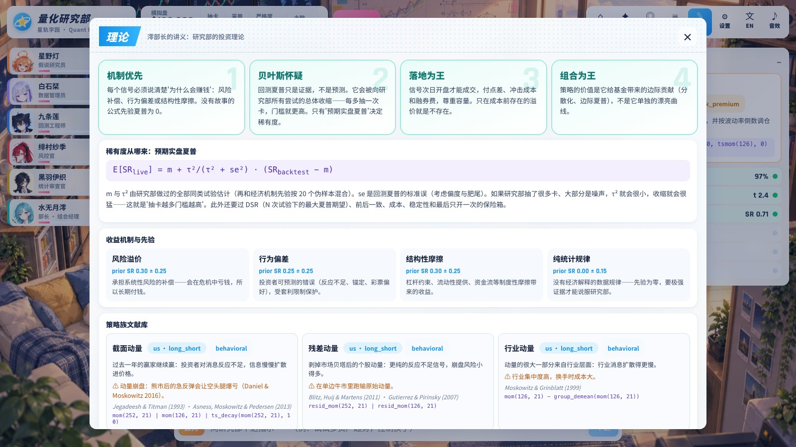

<div align="center">


# 量化研究部 · Quant Research Lab

**星轨学园的六名社团成员，用 LLM 提出假说、用诚实的统计审查它们，再把活下来的策略放进模拟盘。**

[English](README.md) · **简体中文**


<sub>一次研究会议的 2 倍速重播：标题卡 → 全员集合 → 假说 → 数据检查 → 回测揭晓 → 风控与统计审查 → 裁决切入 → 稀有度揭晓。</sub>

</div>

---

## 这是什么

一个二次元量化研究游戏，同时是一套认真的系统化研究引擎。

- **你是顾问。** 研究部每开一次会就是一次「抽卡」：灯提出假说，栞检查数据有没有偷看未来，莲跑回测，纱季审成本和回撤，伊织用统计学泼冷水，澪决定采用还是驳回。
- **稀有度是算出来的。** N / R / SR / SSR 由「预期实盘夏普」决定——回测夏普经过经验贝叶斯收缩后的后验均值。抽得越多，收缩越狠，门槛越高。市场没有保底。
- **采用的策略进入部费基金**，按贝叶斯均值-方差配置，然后在真实价格上跑模拟盘：收盘后下单、次日开盘成交，和回测是同一条时间线。

v4 是一次从底层开始的重构：量化引擎换成 Python，人设和美术全部重做，前端改成 Q 版部室 + 视觉小说分镜。

<div align="center">

<sub>部室：二头身的部员们在各自工位上做事。右边是这次会议的审查流程，数字实时更新。点小人可以摸头或者用ピコピコ锤敲头。</sub>
</div>

## 快速开始

需要 [uv](https://docs.astral.sh/uv/)（Python）和 Node.js 20+。

```bash
./start.sh
```

```bash
start.cmd
```

第一次启动时，栞会自动下载数据（多资产 ETF 和行业 ETF 约 20 秒，标普 500 时点成分股约 2 分钟），然后浏览器打开 `http://127.0.0.1:8765`。点击标题画面进入部室，再点 **▶ 开始研究**。

开发模式（前端热更新）：

```bash
cd engine && uv run qrl serve
```

```bash
cd app && npm install && npm run dev
```

**研究大脑**按顺序尝试：Claude Code CLI（你的订阅，不需要 API key）→ Anthropic API（设置了 `ANTHROPIC_API_KEY` 时）→ Codex CLI → 离线。离线时研究部照常运转，靠文献库和遗传挖掘出题。

## 部员

<div align="center"></div>

| 部员 | 负责 | 她/他在会上查什么 |
|---|---|---|
| **星野灯** 一年级 | 假说 | 读论文和新闻，把想法写成公式。被驳回会哭，第二天又带着新点子冲进来。 |
| **白石栞** 二年级 | 数据 | 前视模糊测试：把历史截断两次重算，过去的信号值一个都不能变。还查覆盖率和幸存者偏差。 |
| **九条莲** 二年级 | 回测 | 次日开盘成交、隔夜/日内拆分、点差、平方根冲击、融券费、退市折价。靠能量饮料续命。 |
| **绯村纱季** 二年级 | 风控 | 成本吃掉多少收益、回撤、容量曲线、逐年稳定性、是不是「一年奇迹」。敲她的头她会更严格。 |
| **黑羽伊织** 三年级 | 统计审查 | 夏普标准误、紧缩夏普（DSR）、经验贝叶斯后验、因子归因、和基金的相关性。中二，但每句话都有数学。 |
| **水无月澪** 三年级 | 部长·组合经理 | 按门槛清单裁决；只问一个问题：加进来之后基金是不是更好了。 |

每人有一套 22 个动作的二头身 Q 版立绘和 6 种表情的半身立绘：

<div align="center"></div>

## 分镜

每次研究会议按固定的镜头语法播放，事件来自引擎的实时推送；事件积压时自动加速。

| 镜头 | 内容 |
|---|---|
| 标题卡 | 「第 N 次研究会议」斜切色带横扫 |
| 全景 | 全员走到圆桌（寻路绕开家具），各环节负责人走到自己的工位做动作，头顶冒对话气泡和漫符 |
| 视觉小说 | 两张立绘对峙，说话的人高亮、换表情，听的人变暗 |
| 揭晓 | 回测结果卡：净值曲线描绘动画、夏普数字滚动 |
| 切入 | 裁决：集中线色带 + 部长特写 + 「採用 / 保留 / 却下」印章砸下 + 震屏 |
| 抽卡 | 被采用时：光柱 + 卡片翻转，SSR 有彩虹边框和彩带 |

<table>
<tr><td></td><td></td></tr>
<tr><td></td><td></td></tr>
<tr><td></td><td></td></tr>
</table>

日志页可以重播任意一次会议。

## 投资理论

研究部的四条信条（应用内「理论」页有完整讲义）：

1. **机制优先。** 每个信号必须说清楚为什么会赚钱：风险补偿、行为偏差，还是结构性摩擦。没有故事的公式，先验夏普是 0。
2. **贝叶斯怀疑。** 回测夏普只是证据，不是预测。它会向研究部做过的全部同类试验收缩。
3. **落地为王。** 次日开盘成交，付点差、冲击和融券费，尊重容量。只在成本之前存在的溢价，就是不存在。
4. **组合为王。** 策略的价值是它给基金带来的边际贡献，而不是它单独的曲线。

**稀有度公式：**

```
E[SR_live] = m + τ²/(τ² + se²) · (SR_backtest − m)
```

`m` 和 `τ²` 用矩估计从研究部所有同类试验中估出（再和机制先验按 20 个伪样本混合）；`se` 是考虑偏度和肥尾的夏普标准误。如果大部分抽卡都是噪声，`τ²` 会很小，收缩就会很猛。

**门槛清单**（硬门槛不过直接驳回，软门槛不过进候补）：

| 门槛 | 规则 |
|---|---|
| 证据 | 研究区间夏普的 t 值 ≥ 2 |
| 前后一致 | 训练段和验证段夏普都 > 0 |
| 成本 | 扣费夏普 ≥ 毛夏普的 50% |
| 稳定 | ≥ 55% 的年份盈利，去掉最好的一年仍然盈利 |
| 多重检验 | DSR ≥ 0.9，N = 全部抽卡数（含遗传挖掘的每一次评估）按平均相关性折算 |
| 后验 | E[SR_live] ≥ 0.25 且 P(真实夏普 > 0) ≥ 85% |
| 新颖性（软） | 与基金成员相关性 < 0.7 |
| 幸存者偏差（软） | 规模因子暴露不显著（数据里缺的退市公司多是小公司） |
| 保险箱 | 最后两年数据完全隔离，只有通过其他所有门槛之后才打开一次 |

### 在真实数据上它发现了什么

一个空研究部把文献库里每个策略族各抽一次（2005 年到保险箱之前，标普 500 时点成分股 + 多资产 ETF）：

| 策略族 | 股票池 | 构建 | 毛夏普 | 扣费夏普 | 预期实盘夏普 | 成本 bp/年 | 最大回撤 | 结果 |
|---|---|---|---|---|---|---|---|---|
| 截面动量 | 标普500 | 多空 | 0.03 | −0.06 | 0.08 | 42 | −34% | 驳回 N |
| 残差动量 | 标普500 | 多空 | 0.06 | −0.03 | 0.09 | 44 | −46% | 驳回 N |
| 行业动量 | 标普500 | 多空 | 0.13 | 0.04 | 0.13 | 58 | −38% | 驳回 N |
| 短期反转 | 标普500 | 多空 | **0.82** | −0.06 | 0.10 | **673** | −35% | 驳回 N |
| 低波动异象 | 标普500 | 多空 | −0.15 | −0.21 | 0.02 | 16 | −43% | 驳回 N |
| 52 周新高 | 标普500 | 多空 | −0.05 | −0.15 | 0.02 | 58 | −48% | 驳回 N |
| 彩票偏好 | 标普500 | 多空 | −0.24 | −0.45 | −0.13 | 124 | −49% | 驳回 N |
| 同月季节性 | 标普500 | 多空 | 0.16 | −0.05 | 0.06 | 90 | −32% | 驳回 N |
| 隔夜-日内 | 标普500 | 多空 | 0.05 | −0.07 | 0.06 | 42 | −28% | 驳回 N |
| 非流动性 | 标普500 | 多空 | 0.76 | 0.66 | 0.40 | 27 | −16% | 候补（规模暴露 β=0.99，幸存者偏差） |
| 时间序列动量 | 多资产 | 趋势 | 0.43 | 0.39 | 0.35 | 20 | −13% | 驳回（t=1.7） |
| 均线趋势过滤 | 多资产 | 趋势 | 0.58 | 0.53 | 0.40 | 29 | −13% | **采用 R** |
| 风险平价 | 多资产 | 趋势 | 0.50 | 0.49 | 0.40 | 5 | −15% | **采用 R** |
| 跨资产轮动 | 多资产 | 纯多 | 0.21 | 0.20 | 0.22 | 15 | −32% | 驳回 N |
| 行业轮动 | 行业ETF | 纯多 | 0.08 | −0.02 | 0.09 | 55 | −50% | 驳回 N |
| 波动率管理 | 多资产 | 趋势 | 0.42 | 0.40 | 0.35 | 13 | −15% | 驳回（和趋势过滤太像） |

这和学术界的结论一致：大盘股里发表过的截面异象，在扣掉真实成本之后基本已经没了（短期反转的毛夏普 0.82，成本一扣就是负的）；跨资产的趋势和风险平价仍然在赚钱，而且回撤小。纯多头的选股按「和同样调仓的等权组合相比」来判断，所以市场本身的上涨不会被算成本事。

这里没有能保证赚钱的东西。研究部能做的是：不在噪声上下注，不为不存在的溢价付成本。

<table>
<tr><td></td><td></td></tr>
<tr><td></td><td></td></tr>
</table>

<div align="center"></div>

## 引擎

```
engine/qrl
├── data/        Yahoo 日线（全收益复权）、标普 500 时点成分股、多资产和行业 ETF、国债收益率
├── alpha/       安全的表达式语言（ast 白名单）+ 向量化算子，全部只用过去的数据
├── portfolio/   打分 → 仓位：多空 / 纯多头分位 / 趋势风险定仓，波动率目标
├── backtest/    逐日模拟：次日开盘成交、隔夜/日内拆分、持仓漂移、现金按国债利率计息、融券费、退市折价、容量曲线
├── stats/       夏普标准误、PSR、DSR、经验贝叶斯后验、Newey-West IC、CSCV PBO、因子归因
├── research/    评估流水线、门槛、试验登记簿（SQLite）、文献库、LLM 提案、遗传挖掘、改良、Thompson 抽样、基金
├── live/        内部模拟盘（次日开盘成交）+ 可选的 Alpaca 模拟账户
├── cast/        人设与台词（中英双语，台词里的每个数字都来自审计结果）
└── server/      FastAPI + WebSocket 事件流，收盘后自动刷新数据、推进模拟盘
```

**数据。** 标普 500 使用时点成分股（含已被剔除的公司）：某只股票只有在它确实是成分股的日子里才能交易。这去掉了「用今天的赢家回测过去」的大部分偏差。Yahoo 上已经没有数据的退市公司（约 300 只）仍然缺失，所以有「幸存者偏差」门槛，这件事也写在每份报告里。

**成本。** 半点差 = 0.15 × σ / √(ADV/100 万美元)，大盘股下限 1bp、危机时自动变宽；冲击 = 0.7 × σ × √(成交额/ADV)；融券年费 0.3%（难借 3%）。零售规模下冲击几乎为零，容量曲线会告诉你规模变大时夏普怎么衰减。

**表达式语言。** 例如 `rank(resid_mom(252, 21)) - 0.5 * rank(vol(63))`、`where(trend(200) > 0, tsmom(126), 0) * inv(vol(21))`。LLM 和遗传挖掘只能写这种表达式，写不了代码。每个新公式都要过前视模糊测试。

**测试。** `cd engine && uv run pytest`：74 个测试，全部用合成数据，包括「故意作弊的算子能被抓到」和「发生在隔夜缺口里的收益无法在次日开盘捕获」。

## 前端

```
app/src
├── stage/     Q 版部室：60fps 命令式引擎（寻路、跳跃步态、朝向、景深缩放、呼吸），昼夜光照跟随美股时间
├── story/     分镜导演 + 对话框 / VN / 标题卡 / 揭晓卡 / 切入 / 抽卡揭晓
├── hud/       顶栏、部员名册、会议看板、顾问指令栏
├── screens/   图鉴、专业报告、基金、日志（可重播）、理论、设置、部员档案、标题画面
└── lib/       API、状态、双语文案、合成音效（WebAudio，无音频文件）
```

## 美术

所有美术为本次重做：人设、全员设定图、6 × 6 张表情立绘、6 × 22 个 Q 版动作、5 张背景、主视觉。用 Codex 图像生成在绿幕上出图（`art/jobs.py` 里有全部提示词），`art/process.py` 负责软抠像、去绿边、按网格切分 Q 版动作、按站姿统一缩放、脚底对齐、统一裁切表情立绘。

```bash
QRL_ART_WORK=~/qrl-art python3 art/gen.py 'chibi-*'
```

```bash
uv run --with pillow --with numpy --with scipy python art/process.py ~/qrl-art/raw app/public/art
```

## 说明

- 全部是模拟 / 纸面交易，代码里没有任何实盘资金路径。不构成投资建议。
- 数据来自 Yahoo Finance，仅供个人研究使用，不随仓库分发，首次启动时下载到本地。
- v3 及更早的代码在 tag `v3-final`。

## 致谢

| | |
|---|---|
| **Shoral Rat** ([@shoal-rat](https://github.com/shoal-rat)) | 创意、方向、项目所有者 |

策略文献见 `engine/qrl/research/knowledge.py` 和应用内的「理论」页。
